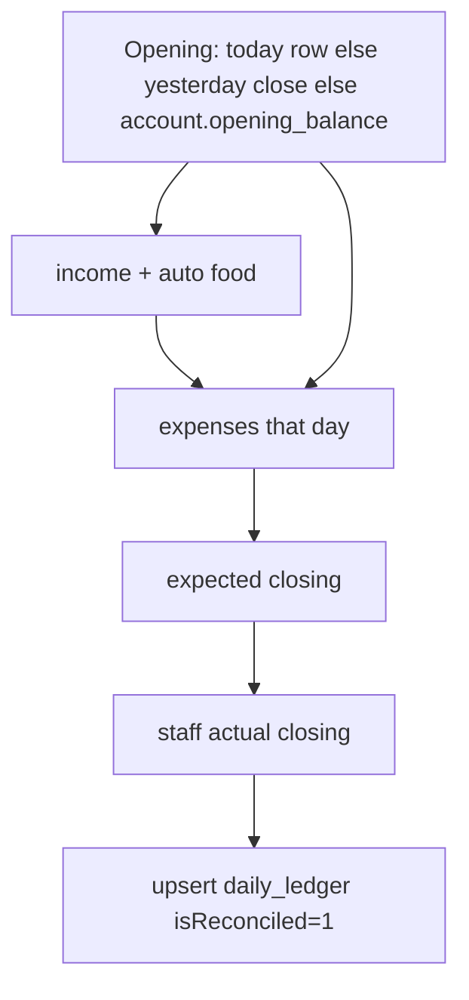

# Accounts (expenses, ledger, salary)

**Git-safe.** Admin `/admin` → Accounts. Bill photos → Google Drive (folder id in secrets file) under `Goko Bills/{MONTH}/`.

---

## Tabs

| Tab | Perm (non-admin) | API |
|-----|------------------|-----|
| Add Expense | `canAddExpense` | `addExpense` |
| Daily Ledger | `canAddIncome` | `getDailyLedger`, `addDailyIncome` |
| Records | `canViewExpenses` | `listExpenses` |
| Food Revenue | `canViewFoodBills` | `getFoodRevenue` |
| Reconcile | `canReconcile` | `getReconciliation`, `saveReconciliation`, `undoReconciliation` |

Account Settings (Management): accounts/vendors/employees/salary — `canManageAccounts`. Bulk XLSX: `/api/admin/bulk-import-accounts`.

---

## Money

All integers **paise**. UI: rupees × 100 on the way in.

---

## Add expense

Amount, stay vs food, category, vendor, cash/online, account if online, notes, bill images (base64). Drive upload failure still saves the expense with empty/failed link. Audit `expense_added`.

**Splits bridge:** Goko-as-payer and `payGokoReimbursement` insert the same `expenses` row (paise, `getMonthKey()` UTC, cash `accountId` null, never `paySalary` / Salary). See [flows-splits.md](flows-splits.md). Splits IOUs are **not** Accounts until cash moves.

---

## Ledger + reconcile

Unique `(date, account_id)`. Mismatch highlight if |diff| > ₹0.50. `adjustOpeningBalance` without reconciling (manage accounts). `undoReconciliation` clears the lock.

Food revenue on the ledger is **paid non-cancelled food orders** for that date (not the same as `daily_income` unless auto-posted).

---

## Salary

`paySalary` → `salary_payments` **and** `expenses` category Salary. Month string on both.

---

## Bulk import

XLSX template → validate → dedupe → batch 50. Duplicate expense: date + amount + category + notes. Income: date + amount + source + description. Excel serial dates supported.
